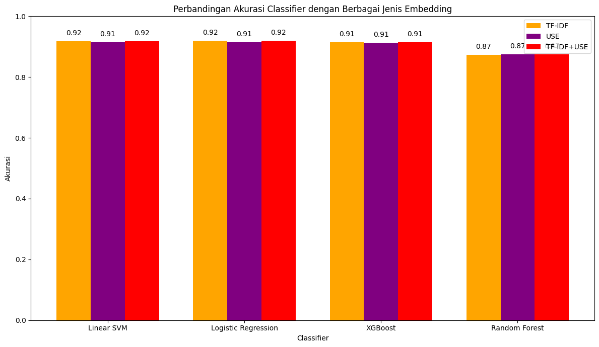
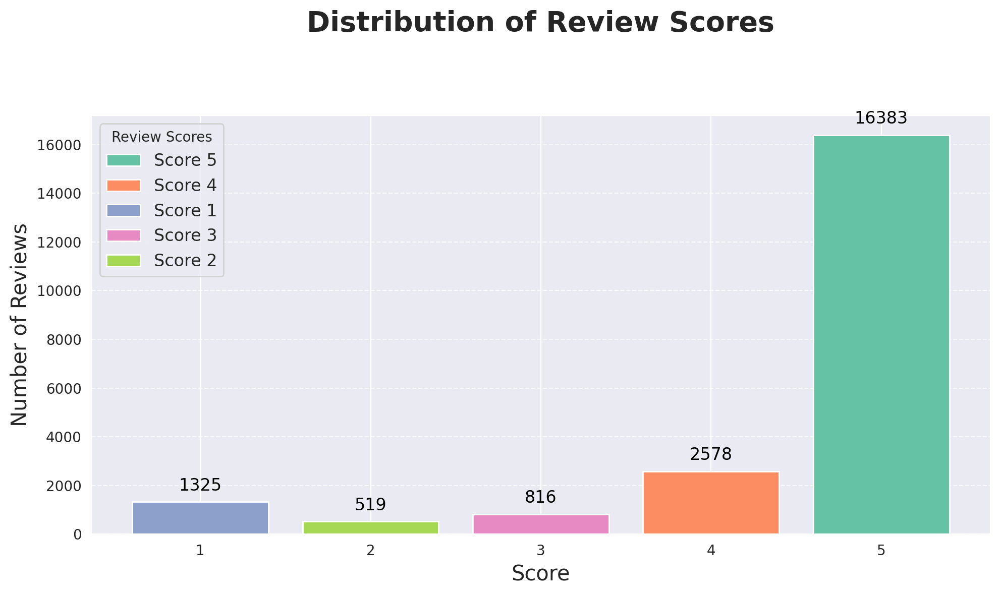
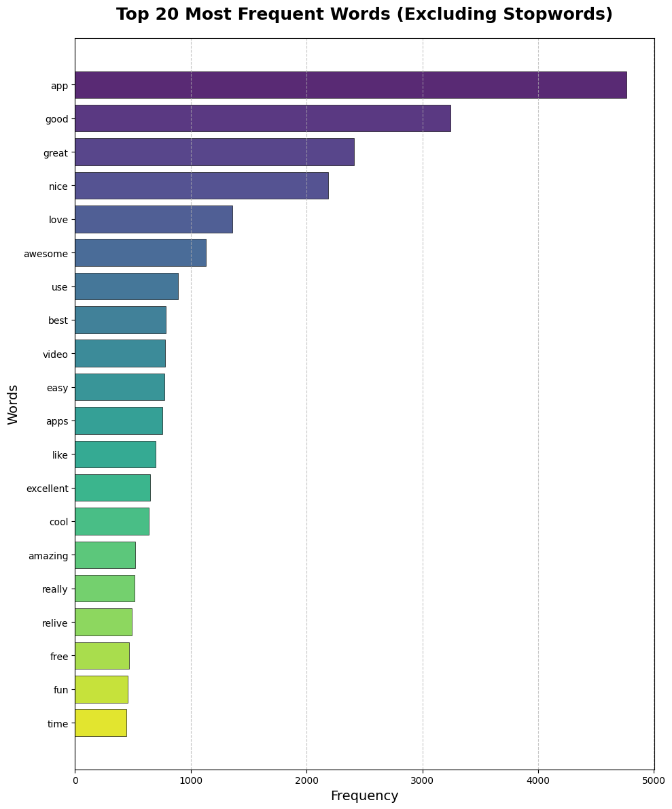
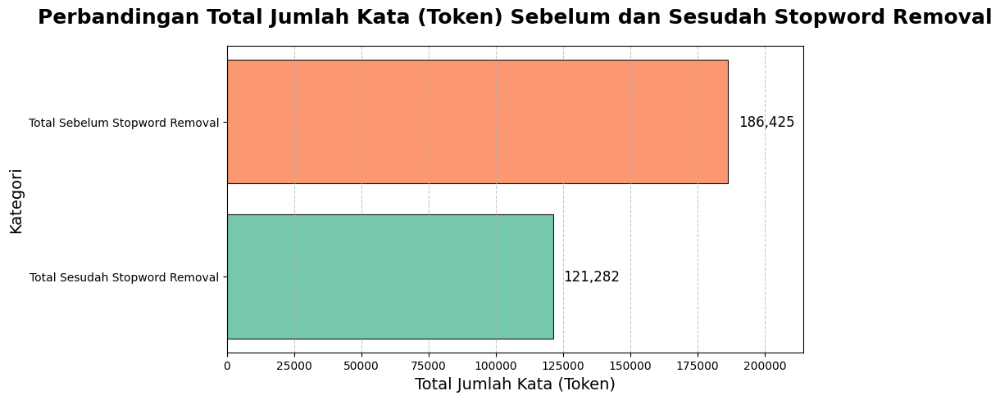
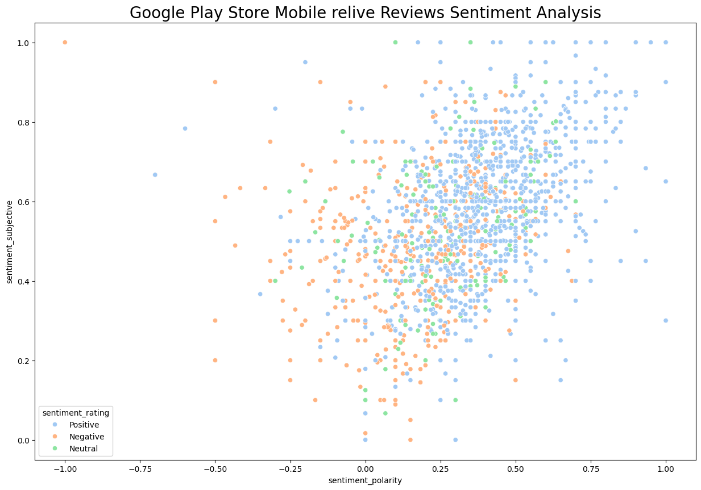
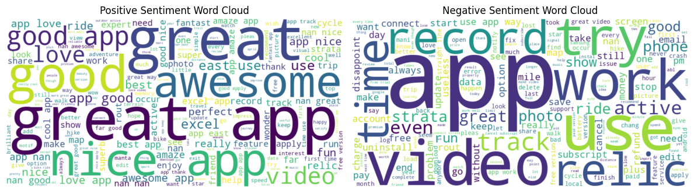
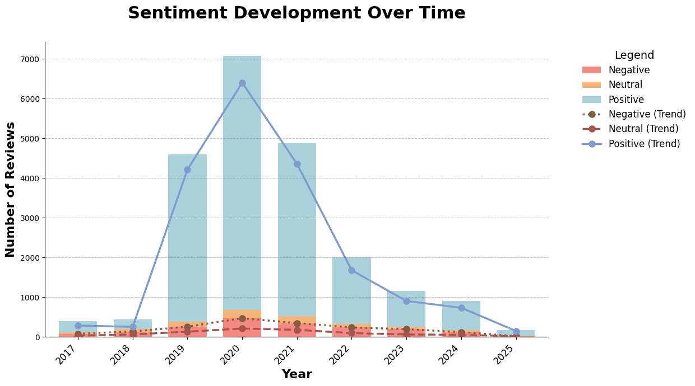

# Sentiment Analysis on Relive App Reviews
This project focuses on performing sentiment analysis on the reviews of the **Relive App**, which is a sports-focused application. The analysis is based on reviews obtained via web scraping from the Google Play Store. The project aims to explore user sentiments towards the app, identify patterns, and classify reviews into positive, neutral, or negative sentiments.

| **Title**                           | **Author**            | **Date**    | **Output**                                                                                             |
|-------------------------------------|-----------------------|-------------|--------------------------------------------------------------------------------------------------------|
| Sentiment Analysis on Relive App Reviews | Diva Ardelia Alyadrus | 15/03/2025  | df_reliveref.csv (raw), df_reliverev_clean (pre-processed), df_reliverev_sentiment.csv (final sentiment) |

## Repository Structure

```
📂 Sentiment-Analysis-ReliveApp
├── assets/              # Directory for images and other visual assets
│   ├── visual1.png
│   ├── visual2.jpg
│   ├── visual3.png
│   ├── visual4.png
│   ├── visual5.png
│   ├── visual6.png
│   ├── visual7.jpg
│   ├── visual8.png
│
├── data/                # Raw and processed datasets
│   ├── df_reliverev.csv     # Original scraped dataset
│   ├── reliverev_cleaned.csv  # Processed dataset (cleaned)
│   ├── reliverev_sentiment.csv # Dataset with sentiment scores
│
├── notebooks/           # Jupyter Notebooks for analysis
│   ├── 01-relive-reviews-scrapping.ipynb  # Scraping Google Play Store reviews
│   ├── 02-relive-reviews-exploratory-data-analysis.ipynb  # EDA on scraped reviews
│   ├── 03-relive_reviews_data_preprocessing.ipynb  # Data cleaning and preprocessing
│   ├── 04-relive_reviews_sentiment_analysis.ipynb  # Sentiment analysis on the reviews
│   ├── 05-relive_reviews_tf-idf.ipynb  # TF-IDF for feature extraction
│
├── README.md            # Project introduction (this file)

```
## Table of Contents
- [Project Overview](#project-overview)
- [Notebooks](#notebooks)
- [Data](#data)
- [Getting Started](#getting-started)
- [How to Run](#how-to-run)
- [Exploratory Data Analysis (EDA)](#exploratory-data-analysis)
- [Data Preprocessing](#data-preprocessing)
- [Sentiment Analysis](#sentiment-analysis)
- [Visualizations](#visualizations)
- [References](#references)

## Project Overview
The **Relive App** is a popular mobile application used to record and share sports activities. In this project, we perform sentiment analysis on the user reviews of this app to understand user satisfaction and identify areas for improvement.

### Goal
- Perform **Exploratory Data Analysis (EDA)** on the reviews dataset.
- Clean and preprocess the data to make it ready for analysis.
- Use sentiment analysis techniques to classify reviews into positive, neutral, or negative categories.

---

## Notebooks
The project is divided into the following Jupyter Notebooks:

1.  **01-relive-reviews-scrapping.ipynb** Scraping the reviews of the Relive app from the Google Play Store using web scraping techniques.

2.  **02-relive-reviews-exploratory-data-analysis.ipynb** Performing exploratory data analysis (EDA) on the scraped reviews to understand their distribution and key statistics.

3.  **03-relive_reviews_data_preprocessing.ipynb** Data cleaning and preprocessing, including handling missing values, outliers, and transforming text data for analysis.

4.  **04-relive_reviews_sentiment_analysis.ipynb** Performing sentiment analysis on the reviews using machine learning models.

5.  **05-relive_reviews_tf-idf.ipynb** Implementing TF-IDF for transforming text data into numerical features for classification tasks.

---

## Data
This project uses the following datasets:

1.  **df_reliverev.csv** The raw data scraped from Google Play Store, containing user reviews, scores, and other metadata.

2.  **df_reliverev_cleaned.csv** A cleaned version of the data after preprocessing steps such as handling missing values and transforming text data.

3.  **df_reliverev_sentiment.csv** Contains the sentiment classification results for each review (positive, neutral, negative).

### Structure of `df_reliverev`
The `df_reliverev` dataset contains the following columns:

| **Column** | **Description** | **Data Type** |
|---|---|---|
| `reviewId` | Unique identifier for each review | Object |
| `userName` | Name of the user who wrote the review | Object |
| `userImage` | URL of the user's profile image | Object |
| `content` | The text content of the user's review | Object |
| `score` | Rating given by the user (1-5) | Integer |
| `thumbsUpCount` | Number of thumbs-up given by other users for this review | Integer |
| `reviewCreatedVersion` | Version of the app when the review was written | Object |
| `at` | Date and time when the review was posted | Datetime |
| `replyContent` | Content of the reply given by the app developers (if any) | Object |
| `repliedAt` | Date and time when the reply was posted (if any) | Datetime |
| `appVersion` | Version of the app when the review was written | Object |

---

## Getting Started
To get started with this project, you need to set up a Python environment with the required dependencies. You can use `pip` or `conda` to install the necessary packages.

### Prerequisites
Make sure you have Python 3.7+ installed on your system. You will also need the following libraries:

-   pandas
-   numpy
-   matplotlib
-   seaborn
-   scikit-learn
-   tensorflow (for sentiment analysis)
-   nltk
-   googletrans
-   plotly

---

## How to Run
To run this project:
1.  **Clone the repository:**
    ```bash
    git clone [https://github.com/your_username/Sentiment-Analysis-ReliveApp.git](https://github.com/your_username/Sentiment-Analysis-ReliveApp.git)
    cd Sentiment-Analysis-ReliveApp
    ```
2.  **Create a virtual environment (recommended):**
    ```bash
    python -m venv venv
    source venv/bin/activate  # On Windows: `venv\Scripts\activate`
    ```
3.  **Install the dependencies:**
    ```bash
    pip install -r requirements.txt
    # If requirements.txt is not provided, you can install them manually:
    # pip install pandas numpy matplotlib seaborn scikit-learn tensorflow nltk googletrans plotly
    ```
4.  **Download NLTK data:**
    ```python
    import nltk
    nltk.download('stopwords')
    nltk.download('words')
    nltk.download('wordnet')
    nltk.download('punkt')
    ```
5.  **Run the Jupyter Notebooks:**
    Navigate to the `notebooks/` directory and open the notebooks in sequential order (01 to 05) to follow the project workflow.
    ```bash
    jupyter notebook
    ```

---

## Exploratory Data Analysis (EDA)
The EDA phase (covered in `02-relive-reviews-exploratory-data-analysis.ipynb`) involves:
-   Loading and inspecting the raw scraped data.
-   Checking for missing values and data types.
-   Analyzing the distribution of review scores.
-   Visualizing the word frequency in the review content.
-   Identifying common themes and patterns in the reviews.

---

## Data Preprocessing
The data preprocessing phase (covered in `03-relive_reviews_data_preprocessing.ipynb`) includes:
-   Handling missing values.
-   Text cleaning:
    -   Lowercasing.
    -   Removing punctuation, numbers, and special characters.
    -   Tokenization.
    -   Removing stop words.
    -   Stemming/Lemmatization.
    -   Spell correction.
-   Feature engineering for sentiment analysis.

---

## Sentiment Analysis
The sentiment analysis phase (covered in `04-relive_reviews_sentiment_analysis.ipynb` and `05-relive_reviews_tf-idf.ipynb`) focuses on:
-   **Text Representation:**
    -   **TF-IDF:** Transforming text data into numerical features using Term Frequency-Inverse Document Frequency.
    -   **Universal Sentence Encoder (USE):** Using pre-trained deep learning models to generate dense embeddings for sentences.
    -   **Combined Embeddings:** Exploring the combination of TF-IDF and USE embeddings.
-   **Model Training:**
    -   Splitting data into training and testing sets.
    -   Training various machine learning classifiers: Linear SVM, Logistic Regression, Naive Bayes, XGBoost, and Random Forest.
-   **Model Evaluation:**
    -   Assessing model performance using metrics such as accuracy, precision, recall, and F1-score.
    -   Analyzing confusion matrices and classification reports for each model and embedding strategy.
    -   Comparing the performance of different classifiers and embedding techniques through visualizations.

### Model Performance
Here is a comparison of the sentiment classification model accuracies across different embedding strategies:

*Classifier Accuracies with Different Embeddings:*


---

## Visualizations
This section provides key visualizations that offer insights into the dataset and model performance.

*Distribution of Review Scores:*

*This visualization shows the spread of review scores given by users.*
*Review Count Over Time:*

*This chart illustrates the volume of reviews collected over a period, indicating trends in user engagement.*
*Top Word Frequencies:*

*This graph displays the most frequently occurring words in the reviews, providing initial insights into key topics.*
*Word Cloud of Common Terms:*

*A comparison between word count before and after stopword removal.*
*Sentiment Analysis Distribution:*

*This visualization visualize distribution of sentiment analysis towards relive app based on its reviews.*
*Review Distribution by App Version:*

*A word cloud visually represents word frequency, with larger words indicating higher occurrence.*
*Heatmap of Feature Correlation:*

*This visualization illustrates how the sentiment (positive, neutral, negative) of reviews changes or trends over different time periods, providing insights into user satisfaction evolution.*
*Classifier Accuracies with Different Embeddings:*

*This graph illustrates the performance of various models (Linear SVM, Logistic Regression, XGBoost, Random Forest) using TF-IDF, USE, and the combined TF-IDF+USE embeddings. It highlights which embedding strategy yields better results for each classifier.*

---

## References
-   Sentiment Analysis on IMDB dataset: [https://github.com/FarhanaTeli/Sentiment_Analysis_IMDB](https://github.com/FarhanaTeli/Sentiment_Analysis_IMDB)
-   TF-IDF implementation: [https://github.com/Wittline/tf-idf](https://github.com/Wittline/tf-idf)
